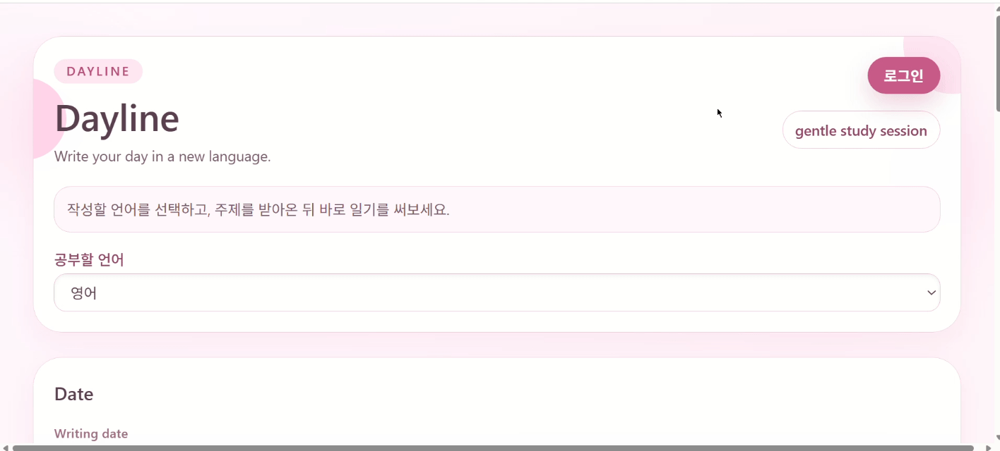
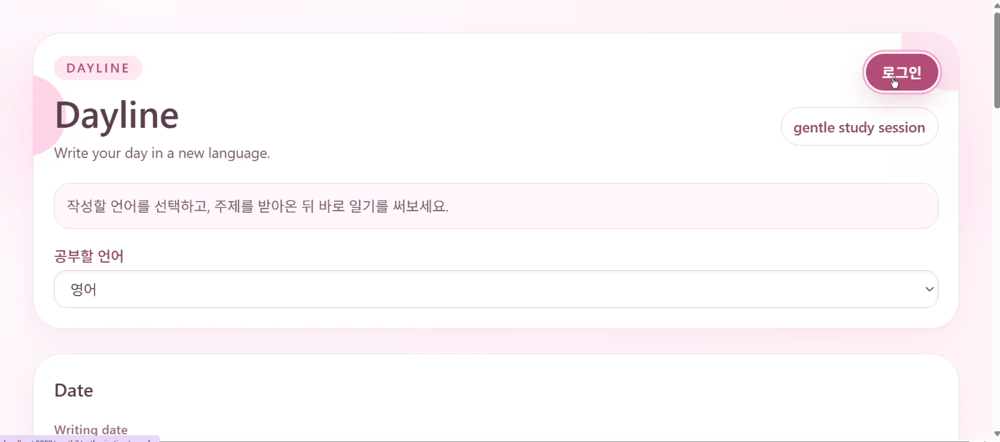
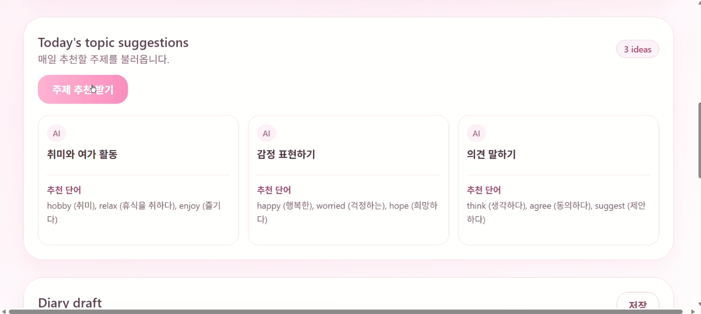
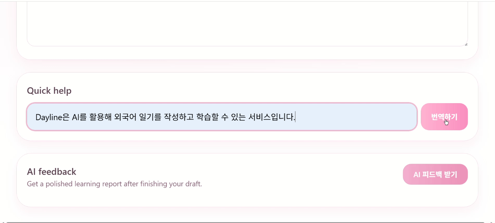
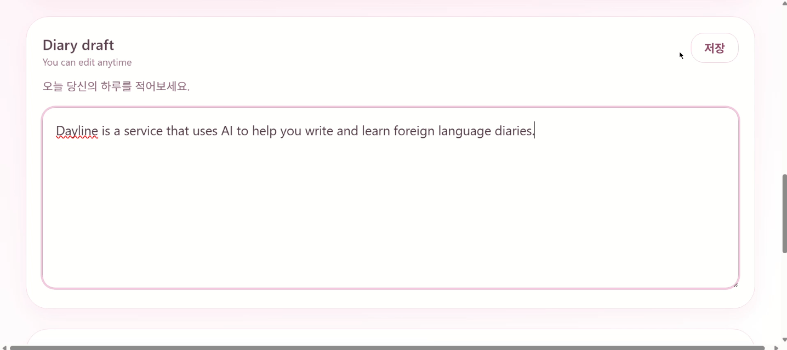
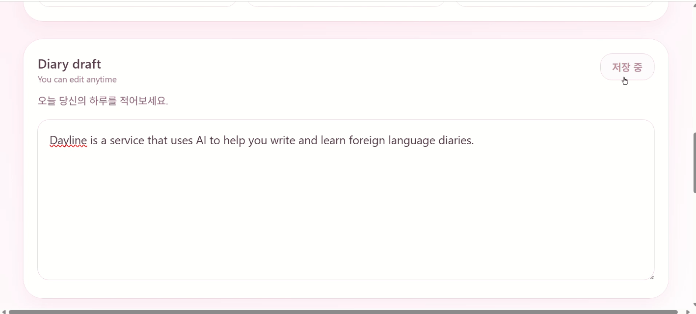
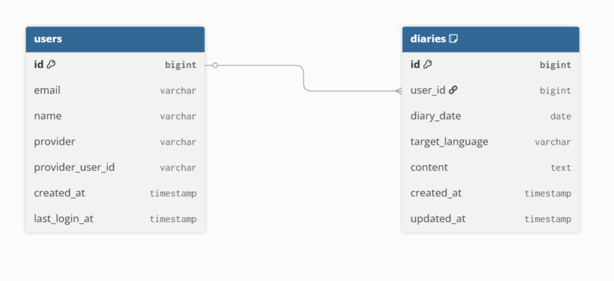

# Dayline

Dayline은 외국어 일기 작성 과정에서 필요한 주제 추천, 번역, 피드백을 하나의 흐름으로 제공하는 AI 기반 외국어 학습 서비스입니다.

외국어 학습을 위해 외국어로 일기를 쓰다 보면
- 어떤 주제로 써야 할지 모르겠고
- 모르는 표현은 번역기를 계속 오가야하고
- 자연스러운 표현이 맞는지 확인하기 어렵다는 불편함이 있었습니다.

Dayline은 이러한 과정을 하나의 서비스에서 해결할 수 있도록 제작했습니다.

## Preview

### 🏠 메인 화면

날짜와 학습 언어를 선택해 일기를 작성하고, AI 기능을 이용할 수 있는 메인 화면입니다.

---

## 주요 기능
- Google OAuth2 로그인
- JWT 기반 사용자 인증
- 날짜·언어별 일기 조회 및 저장
- AI 주제 추천
- AI 번역
- AI 피드백
- 사용자별 일기 관리

---

## 기능 시연

### Google Login

Google OAuth2 로그인을 통해 사용자를 인증하고, 로그인 성공 시 JWT를 발급받아 인증을 유지합니다.

### AI 주제 추천

선택한 학습 언어에 맞춰 AI가 일기 주제를 추천하고, 함께 사용할 수 있는 단어를 제공합니다.

### 번역

작성 중 모르는 표현이나 문장을 원하는 학습 언어로 번역하여 자연스럽게 작성할 수 있도록 도와줍니다.

### AI 피드백

작성한 일기를 AI가 분석하여 문법과 표현을 교정하고, 더 자연스러운 문장을 제안합니다.

### 일기 저장 및 조회

날짜와 학습 언어를 기준으로 일기를 저장하고, 기존에 작성한 내용을 다시 조회하거나 수정할 수 있습니다.

---

## 기술 스택

### Frontend
- React
- TypeScript
- Vite
- Tailwind CSS

### Backend
- Java 17
- Spring Boot
- Spring Security
- OAuth2 Client
- JWT
- Spring Data JPA
- PostgreSQL

---

## 구현하면서 고민한 점
### JWT를 이용한 사용자 식별
초기에는 요청 Body에 `userId`를 포함하여 일기를 조회하고 저장하도록 구현했습니다.

하지만 클라이언트에서 전달하는 사용자 정보는 위변조될 수 있기 때문에,
Spring Security의 JWT 인증 정보를 통해 로그인한 사용자를 식별하도록 변경했습니다.

이를 통해 클라이언트가 전달한 사용자 정보를 신뢰하지 않고,
인증된 사용자만 자신의 일기를 조회하고 수정할 수 있도록 구현했습니다.

### 날짜·언어 기준 일기 관리

하나의 날짜에 하나의 언어로 여러 개의 일기가 저장되는 것을 방지하기 위해

`user_id + target_language + diary_date`

조합에 **Unique 제약**을 적용했습니다.

일기 저장 요청 시에는 먼저 기존 데이터를 조회하여

- 기존 일기가 있으면 수정(Update)
- 없으면 새로 생성(Insert)

하는 방식으로 중복 저장을 방지했습니다.


### OpenAI 응답 구조화

AI 기능은 단순히 텍스트를 반환하는 방식이 아니라,
기능별로 JSON 형식을 지정하여 응답하도록 구현했습니다.

이를 통해

- 주제 추천
- 번역
- AI 피드백

기능을 각각 DTO로 처리할 수 있었고,
프론트엔드에서도 일관된 형태의 데이터를 사용할 수 있도록 구성했습니다.


### Google OAuth2와 JWT 인증

Google OAuth2 로그인을 통해 사용자 인증을 수행하고,
로그인 성공 시 JWT를 발급하도록 구현했습니다.

이후 보호된 API 요청은 JWT 인증 필터를 통해 사용자를 검증하며,
로그인한 사용자만 AI 기능과 일기 저장 기능을 사용할 수 있도록 구성했습니다.

---

## DB 설계

### ERD



### users

| Column | Description |
|---------|-------------|
| id | 사용자 ID |
| email | 이메일 |
| name | 사용자 이름 |
| provider | 로그인 제공자 |
| provider_user_id | 제공자 사용자 ID |
| created_at | 생성일 |
| last_login_at | 마지막 로그인 |

### diaries

| Column | Description |
|---------|-------------|
| id | 일기 ID |
| user_id | 사용자 ID(FK) |
| diary_date | 작성 날짜 |
| target_language | 학습 언어 |
| content | 일기 내용 |
| created_at | 생성일 |
| updated_at | 수정일 |

> `user_id + target_language + diary_date` 조합에 Unique 제약을 적용하여 동일한 날짜와 언어의 중복 저장을 방지했습니다.

---

## 실행 방법

### Backend

```bash
cd backend/dayline-api
./gradlew bootRun
```

기본 주소

```
http://localhost:8080
```

### Frontend

```bash
cd frontend
npm install
npm run dev
```

기본 주소

```
http://localhost:5173
```

### Database

PostgreSQL을 사용합니다.

프로젝트 실행 후 Hibernate가 필요한 테이블을 자동 생성합니다.

---

## 환경 변수

```env
OPENAI_API_KEY=...
GOOGLE_CLIENT_ID=...
GOOGLE_CLIENT_SECRET=...
JWT_SECRET=...
```
---
## 향후 개선 예정

- Refresh Token 도입
- JWT 만료 처리 및 재로그인 흐름 개선
- 로그아웃 시 토큰 무효화 처리
- AI 피드백 품질 개선
- 일기 검색 및 통계 기능 추가
- 다국어 UI 지원

